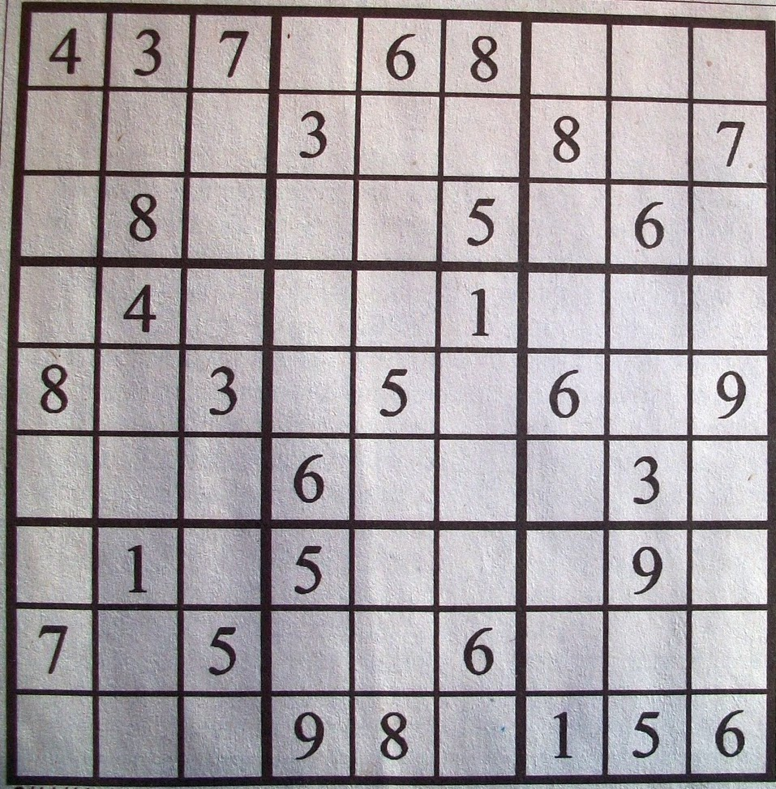

# Deep Sudoku Solver

In this project, a picture of a sudoku puzzle is given as an input, and the solved puzzle will be printed in the terminal. It uses a digit recognition model that is trained by MNIST dataset to detect digits, and OpenCV and OCR methods to detect sudoku from a given image. The script for solving the classic sudoku [`solve_sudoku_text.py`](solve_sudoku_text.py) is from [here](https://github.com/tavasolireza/Sudoku-Solver).

## How To Run

Run the [`main.py`](main.py) script, and enter the address of the sudoku's image. Then, the solved sudoku is shown in the console.

**Sample Input**

**Output**

<pre>
 4 3 7 | 1 6 8 | 9 2 5 
 5 6 1 | 3 9 2 | 8 4 7 
 2 8 9 | 7 4 5 | 3 6 1 
-------+-------+-------
 9 4 6 | 8 3 1 | 5 7 2 
 8 7 3 | 2 5 4 | 6 1 9 
 1 5 2 | 6 7 9 | 4 3 8 
-------+-------+-------
 6 1 8 | 5 2 3 | 7 9 4 
 7 9 5 | 4 1 6 | 2 8 3 
 3 2 4 | 9 8 7 | 1 5 6 
</pre>